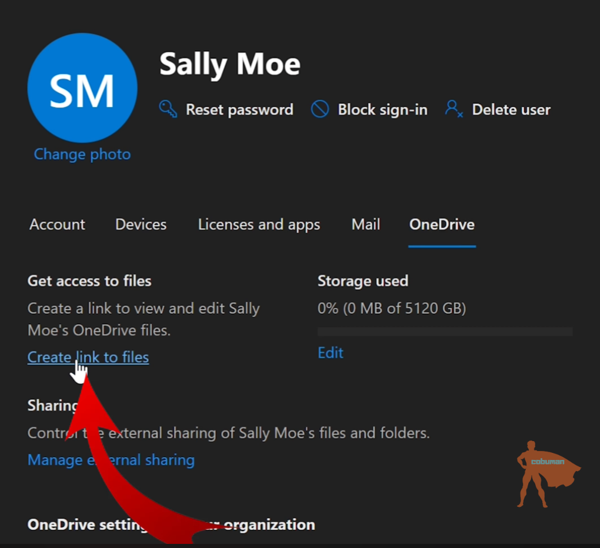
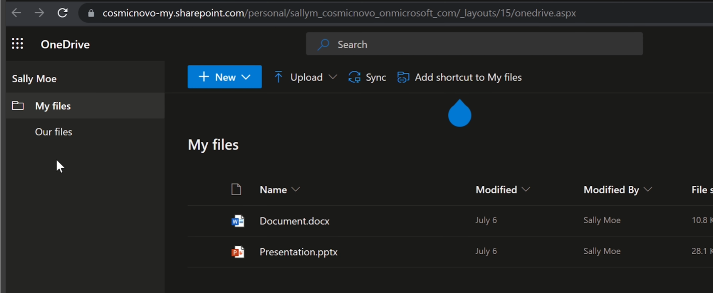
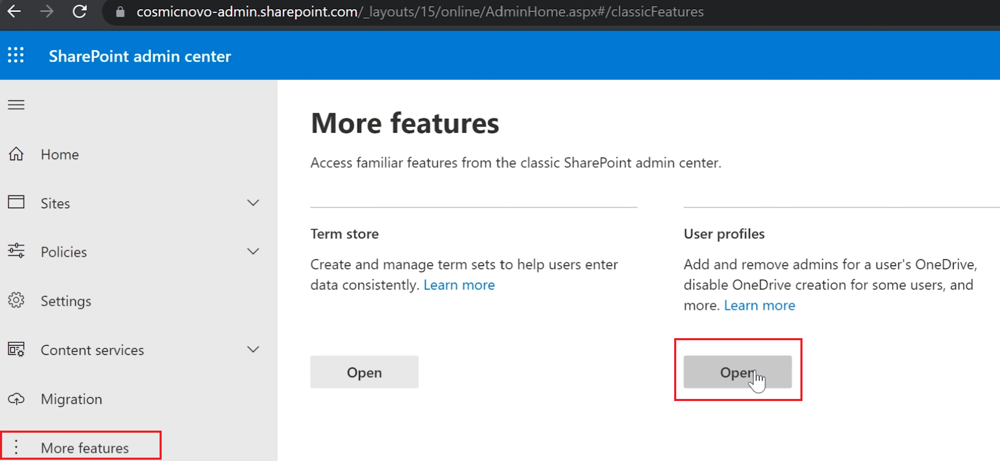
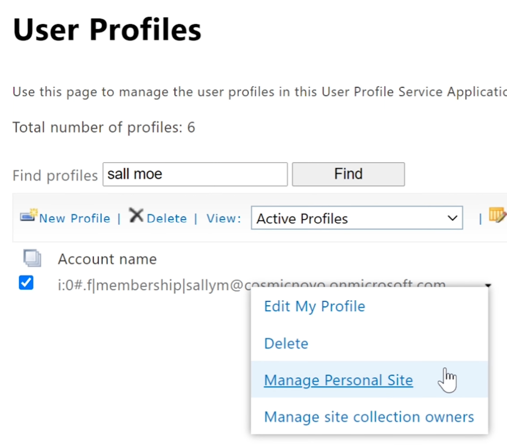
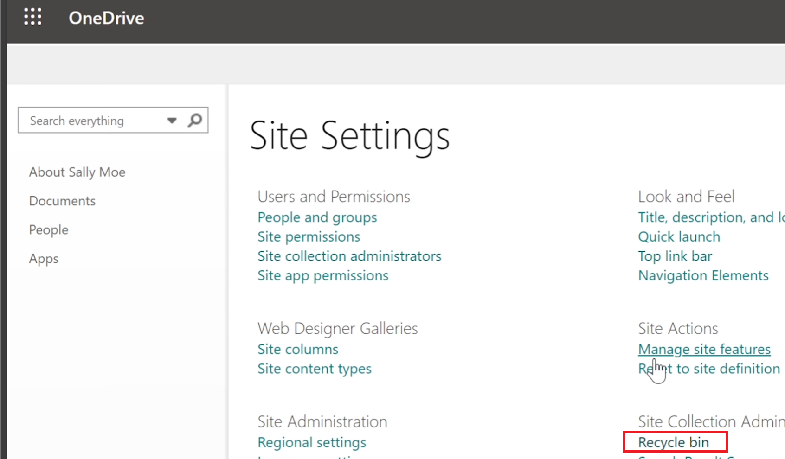
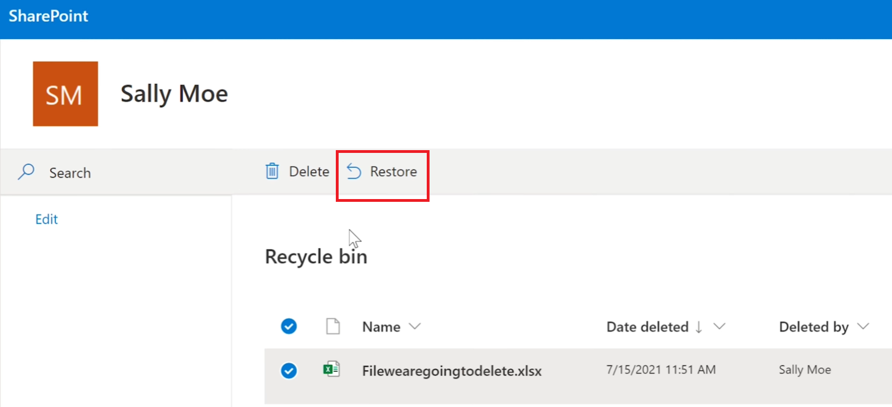

# Office 365 Restoring Deleted Files
## Summary
In this project we will recover deleted files for a user from **OneDrive** and a personal **SharePoint** site.

OneDrive and SharePoint sites are both hosted in SharePoint online, but have different recycle bin locations.

## Acknowledgements
This project was created following [Cobuman's](https://www.youtube.com/watch?v=rlc7kg080FI&list=PL4jgQJG6eMDPBHQ4UHueb1xoABkGO6WbQ) tutorial.

## Environments
- Microsoft 365 Admin Center
- SharePoint Admin Center

## Recovery
### Recover OneDrive for Business Files
If user needs help recovering a deleted file from their OneDrive, we can recover that file for them.

In the Microsoft 365 admin center we navigate to Active Users, then select the user facing the recovery issues and navigate to the OneDrive tab in the pop-up menu and select ```Create link to files```.



After, a link to to the user's files should be generated and we can view their OneDrive contents.



From here we can recover the user's files if the file was deleted from the user's OneDrive for Business drive, else the recycle bin may not be present. 

If the recycle bin is **not** present, then we have to search for the deleted file in the **SharePoint site recycle bin**.

###S Recover SharePoint Site Files
To recover deleted files from SharePoint, we go to the **Sharepoint admin center**. In the Microsoft 365 admin center we go to to:

```Admin centers > SharePoint```

After, on the left pane we select ```...More features```, then on the More features page we select ```User profiles > open```



From here we select ```Manage User Profiles``` and search for the user that needs file(s) recovered. After the user is searched we select ```Manage Personal Site``` in their drop-down.



This allows us to view user's recycle bin and personal site settings from their SharePoint site. 



From here we can restore the deleted file.

